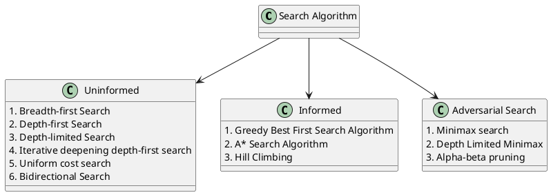
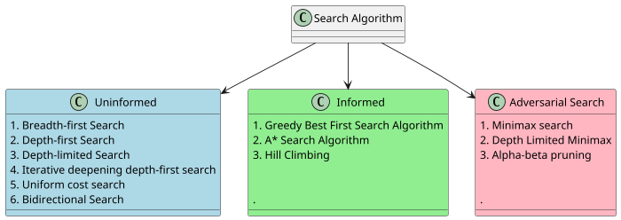

# ARITIFICIAL INTELLIGENCE

## Search Algorithms

Search algorithms in AI are the algorithms that are created to aid the searchers in getting the right solution. The search issue contains search space, first start and end point. Now by performing simulation of scenarios and alternatives, searching algorithms help AI agents find the optimal state for the task. Artificial Intelligence is the study of building agents that act rationally. Most of the time, these agents perform some kind of search algorithm in the background in order to achieve their tasks.

Logic used in algorithms processes the initial state and tries to get the expected state as the solution. Because of this, AI machines and applications just functioning using search engines and solutions that come from these algorithms can only be as effective as the algorithms.

### Search Algorithm Terminologies:

**Search**: Searchingis a step by step procedure to solve a search-problem in a given search space. A search problem can have three main factors:

- **Search Space**: Search space represents a set of possible solutions, which a system may have.
- **Start State**: It is a state from where agent begins the search.
- **Goal test**: It is a function which observe the current state and returns whether the goal state is achieved or not.

**Search tree**: A tree representation of search problem is called Search tree. The root of the search tree is the root node which is corresponding to the initial state.<br>
**Actions**: It gives the description of all the available actions to the agent.<br>
**Goal Test**: The condition that determines whether a given state is a goal state. For example, in a navigator app, the goal test would be whether the current location of the agent (the representation of the car) is at the destination. If it is — problem solved. If it’s not — we continue searching.<br>
**Transition model**: A description of what each action do, can be represented as a transition model.<br>
**Path Cost**: It is a function which assigns a numeric cost to each path.<br>
**Solution**: It is an action sequence which leads from the start node to the goal node.<br>

In a search process, data is often stored in a node, a data structure that contains the following data:

- A state
- Its parent node, through which the current node was generated
- The action that was applied to the state of the parent to get to the current node
- The path cost from the initial state to this node

Nodes contain information that makes them very useful for the purposes of search algorithms. They contain a state, which can be checked using the goal test to see if it is the final state. If it is, the node’s path cost can be compared to other nodes’ path costs, which allows choosing the optimal solution. Once the node is chosen, by virtue of storing the parent node and the action that led from the parent to the current node, it is possible to trace back every step of the way from the initial state to this node, and this sequence of actions is the solution.

However, nodes are simply a data structure — they don’t search, they hold information. To actually search, we use the frontier, the mechanism that “manages” the nodes. The frontier starts by containing an initial state and an empty set of explored items, and then repeats the following actions until a solution is reached

```

Repeat:

If the frontier is empty,
    - Stop. There is no solution to the problem.
Remove a node from the frontier. This is the node that will be considered.

If the node contains the goal state,
    Return the solution. Stop.
Else,
    - Expand the node (find all the new nodes that could be reached from this node), and add resulting nodes to the frontier.
    - Add the current node to the explored set.

```

**Properties of Search Algorithms:**

Following are the four essential properties of search algorithms to compare the efficiency of these algorithms:

**Completeness**: A search algorithm is said to be complete if it guarantees to return a solution if at least any solution exists for any random input.<br>
**Optimality**: If a solution found for an algorithm is guaranteed to be the best solution (lowest path cost) among all other solutions, then such a solution for is said to be an optimal solution.<br>
**Time Complexity**: Time complexity is a measure of time for an algorithm to complete its task.<br>
**Space Complexity**: It is the maximum storage space required at any point during the search, as the complexity of the problem.<br>

### Types of Search Algorithms



### Uninformed Search Algorithms

Uninformed search algorithms are fundamental tools in the field of Artificial Intelligence (AI) used to solve problems where the solution is not known in advance. These algorithms are also known as blind search algorithms because they operate without any specific knowledge about the problem domain.

The term means that the strategies have no additional information about states beyond that provided in the problem definition. All they can do is generate successors and distinguish a goal state from a non-goal state. All search strategies are distinguished by the order in which nodes are expanded.

#### Breadth-first Search

Breadth-first search is a complete search algorithm, guaranteeing that it will find a solution if one exists by exploring all nodes at each level of the search tree.

- It ensures optimality in terms of finding the shallowest goal node, but it may not always find the optimal solution in terms of the least-cost path if edge costs are not uniform.
  <br>
- The algorithm generates all shallower nodes before deeper ones, making it inefficient in terms of time and memory when the search tree is deep.
  <br>
- The use of a **FIFO queue** for the frontier ensures that new nodes are always deeper than their parents, maintaining the breadth-first exploration strategy.
  <br>
- Breadth-first search applies the goal test when a node is generated, ensuring that any found goal node is indeed the shallowest one, eliminating the need to compare multiple shallow goal nodes.

**Algorithm** <br>

1. Start with an initial node containing the starting state of the problem and a path cost of 0.
2. Check if the initial state is a goal state. If it is, you're done, and you have a solution.
3. Create a queue (think of it as a line) called the "frontier" and add the initial node to it.
4. Create an empty set called "explored" to keep track of the states we've already seen.
5. Now, repeat the following steps:
   a. If the frontier is empty (there's no one left in the line), and you haven't found a solution, then you've failed to find a solution. So, return failure.<br>
   b. Take the node at the front of the line (the shallowest one).<br>
   c. Add the state of this node to the explored set, so we remember we've seen it.<br>
   d. For each possible action you can take from the current state: Create a new node that represents the result of taking that action.<br>
6. Keep repeating these steps until you either find a solution or determine that there is no solution (if the frontier becomes empty).<br>

**Completeness**: A search algorithm is complete if it guarantees finding a solution if one exists.<br>

**Optimality**: An optimal search algorithm finds the shortest path to the goal.<br>

**Time Complexity:**<br>

- In the worst case, BFS also has a time complexity of $O(𝑏^d)$(Exponential).
- However, BFS systematically explores all nodes at each depth level before moving to the next level.
- It is particularly efficient in finding the shortest path in an unweighted graph because it guarantees that the shallowest goal node is reached first.

**Space Complexity:**<br>

- The space complexity of BFS is typically $O(𝑏^d)$(Exponential) because it stores all nodes at each depth level in a queue.
- BFS can consume significant memory, especially when the branching factor is high or the tree is deep.
- It guarantees that it explores the shallowest nodes first, but this comes at the cost of increased memory usage.

Where, <br>b = branching factor (require finite b) <br>d = depth of shallowest solution.

**When to Use Uninformed Search:**<br>

- Uninformed search algorithms are suitable for small to moderately sized search spaces where domain-specific knowledge is limited or unavailable.<br>
- They are a good choice when you need a simple, general-purpose approach to problem-solving.<br>

**Limitations:**<br>

- Uninformed search algorithms may be inefficient for large search spaces.<br>
- They do not take advantage of domain-specific information, which can lead to unnecessary exploration.<br>

---

#### Depth-First Search

Depth-First Search (DFS) is a complete search algorithm that explores as far as possible along a branch of the search tree before backtracking.

- It may not guarantee optimality in terms of finding the shortest path, especially when edge costs are not uniform.
- DFS tends to generate a deeper search tree before exploring shallower nodes, which can be more memory-efficient than BFS for deep search trees.
- It uses a Last-In-First-Out (LIFO) stack for managing the frontier, which means it explores one branch entirely before moving on to the next.
- The goal test is applied when a node is selected for expansion, which may lead to multiple solutions.

**Algorithm**

1. Start with an initial node containing the starting state of the problem and a path cost of 0.
2. Check if the initial state is a goal state. If it is, you've found a solution.
3. Create a stack (think of it as a stack of plates) called the "frontier" and add the initial node to it.
4. Create an empty set called "explored" to keep track of the states we've already seen.
5. Now, repeat the following steps: <br>
   a. If the frontier is empty, return failure.<br>
   b. Take the node at the top of the stack (the deepest one).<br>
   c. Add the state of this node to the explored set<br>.
   d. For each possible action you can take from the current state: Create a new node that represents the result of taking that action.<br>
   e. Add the neighboring nodes to the stack.<br>
6. Keep repeating these steps until you either find a solution or determine that there is no solution (if the frontier becomes empty).<br>

**Completeness**: Yes (if the search tree is finite).

**Optimality**: No (it may not find the shortest path).

**Time Complexity**<br>

- In the worst case, DFS can have a time complexity of $O(𝑏^d )$ (Exponential)
- If the search tree is deep and has a high branching factor, DFS can take a long time to find a solution.
- DFS can perform relatively well when the solution is shallow or located early in the search space (small d).

**Space Complexity:**<br>

- The space complexity of DFS is typically $O(bd)$ (Linear), which accounts for the maximum depth of the search tree.
- It uses memory proportional to the depth of the tree because it needs to store all nodes along the current branch in the stack.
- DFS can be memory-efficient when the depth is limited, but it may run into memory issues with deep search trees.

**Advantages**

1. Memory Efficiency: DFS can be more memory-efficient than BFS for deep search trees because it explores deeply before moving to the next branch.
2. Simplicity: Like BFS, DFS is conceptually simple and easy to implement.
3. Solves Uninformed Problems: It's suitable for solving uninformed search problems where the goal is to find any valid solution.

**Disadvantages**

1. Completeness and Optimality: It may not find a solution in infinite or cyclical graphs and doesn't guarantee optimality.
2. Lack of Guidance: DFS doesn't use heuristic information, which can make it less efficient than informed search algorithms in some cases.
3. Potential Infinite Loops: In infinite graphs or graphs with cycles, DFS may get stuck in infinite loops without reaching a solution.
4. Not Suitable for Shortest Path: It doesn't prioritize finding the shortest path, making it unsuitable for certain problems.

---

### Informed Search Algorithms

#### Greedy Best First Search



## Logic

In which we design agents that can form representations of a complex world, use a process of inference to derive new representations about the world, and use these new representations to deduce what to do.

1. Humans' intelligence relies on reasoning processes that operate on internal representations of knowledge, as exemplified by knowledge-based agents in AI.
2. Problem-solving agents, while knowledgeable in limited, domain-specific ways, can benefit from more flexible and domain-independent knowledge representations, such as logic.
3. Logic serves as a general class of representations for knowledge-based agents, enabling them to combine and adapt information for various purposes.
4. Propositional logic, though less expressive than first-order logic, offers fundamental concepts and powerful inference technologies for building knowledge-based agents.

### Propositional Logic

Propositional logic is based on propositions, statements about the world that can be either true or false, as in sentences 1-5 above.

1. If it didn’t rain, Harry visited Hagrid today.
2. Harry visited Hagrid or Dumbledore today, but not both.
3. Harry visited Dumbledore today.

Based on these three sentences, we can answer the question “did it rain today?”, even though none of the individual sentences tells us anything about whether it is raining today. Here is how we can go about it: looking at sentence 3, we know that Harry visited Dumbledore. Looking at sentence 2, we know that Harry visited either Dumbledore or Hagrid, and thus we can conclude

4. Harry did not visit Hagrid.

Now, looking at sentence 1, we understand that if it didn’t rain, Harry would have visited Hagrid. However, knowing sentence 4, we know that this is not the case. Therefore, we can conclude

5. It rained today.

To come to this conclusion, we used logic, and today’s lecture explores how AI can use logic to reach to new conclusions based on existing information.

**Sentence**<br>
A sentence is an assertion about the world in a knowledge representation language. A sentence is how AI stores knowledge and uses it to infer new information.

**Propositional Symbols** : Propositional symbols are most often letters (P, Q, R) that are used to represent a proposition.

#### Logical Connectives

Logical connectives are logical symbols that connect propositional symbols in order to reason in a more complex way about the world.

- Not $(\lnot)$ inverses the truth value of the proposition. So, for example, if $P$: “It is raining,” then $\lnot P$: “It is not raining”.

  Truth tables are used to compare all possible truth assignments to propositions. This tool will help us better understand the truth values of propositions when connected with different logical connectives. For example, below is our first truth table:

  | $P$   | $\lnot P$ |
  | ----- | --------- |
  | false | true      |
  | true  | false     |

- And $(\land)$ connects two different propositions. When these two proposition, P and Q, are connected by $(\land)$, the resulting proposition $P \land) Q$ is true only in the case that both P and Q are true.

  | P     | Q     | $P \land Q$ |
  | ----- | ----- | ----------- |
  | false | false | false       |
  | false | true  | false       |
  | true  | false | false       |
  | true  | true  | true        |

- Or $(\lor)$ is true as as long as either of its arguments is true. This means that for $P \lor Q$ to be true, at least one of P or Q has to be true.

  | P     | Q     | $P \land Q$ |
  | ----- | ----- | ----------- |
  | false | false | false       |
  | false | true  | true        |
  | true  | false | true        |
  | true  | true  | true        |

  It is worthwhile to mention that there are two types of Or: an inclusive Or and an exclusive Or. In an exclusive Or, $P \lor Q$ is false if $P \land Q$ is true. That is, an exclusive Or requires only one of its arguments to be true and not both. An inclusive Or is true if any of $P$, $Q$, or $P \land Q$ is true. In the case of Or $(\lor)$, the intention is an inclusive Or.

- Implication $(\to)$ represents a structure of “if $P$ then $Q$.” For example, if $P$: “It is raining” and $Q$: “I’m indoors”, then $P \to Q$ means “If it is raining, then I’m indoors.” In the case of $P$ implies $Q (P \to Q), P$ is called the antecedent and $Q$ is called the consequent.<br>

  When the antecedent is true, the whole implication is true in the case that the consequent is true (that makes sense: if it is raining and I’m indoors, then the sentence “if it is raining, then I’m indoors” is true). When the antecedent is true, the implication is false if the consequent is false (if I’m outside while it is raining, then the sentence “If it is raining, then I’m indoors” is false). However, when the antecedent is false, the implication is always true, regardless of the consequent. This can sometimes be a confusing concept. Logically, we can’t learn anything from an implication $(P \to Q)$ if the antecedent $(P)$ is false. Looking at our example, if it is not raining, the implication doesn’t say anything about whether I’m indoors or not. I could be an indoors type and never walk outside, even when it is not raining, or I could be an outdoors type and be outside all the time when it is not raining. When the antecedent is false, we say that the implication is trivially true.

  | $P$   | $Q$   | $P \to Q$ |
  | ----- | ----- | --------- |
  | false | false | true      |
  | false | true  | true      |
  | true  | false | false     |
  | true  | true  | true      |

- **Biconditional ($\iff$)** is an implication that goes both directions. You can read it as “if and only if.” $P \iff Q$ is the same as $P → Q$ and $Q → P$ taken together. For example, if $P$: “It is raining.” and $Q$: “I’m indoors,” then $P \iff Q$ means that “If it is raining, then I’m indoors,” and “If I’m indoors, then it is raining.” This means that we can infer more than we could with a simple implication. If $P$ is false, then $Q$ is also false; if it is not raining, we know that I’m also not indoors.

  | $P$   | $Q$   | $P \iff Q$ |
  | ----- | ----- | ---------- |
  | false | false | true       |
  | false | true  | false      |
  | true  | false | false      |
  | true  | true  | true       |

#### Model

The model is an assignment of a truth value to every proposition. To reiterate, propositions are statements about the world that can be either true or false. However, knowledge about the world is represented in the truth values of these propositions. The model is the truth-value assignment that provides information about the world.

For example, if P: “It is raining.” and Q: “It is Tuesday.”, a model could be the following truth-value assignment: {P = True, Q = False}. This model means that it is raining, but it is not Tuesday. However, there are more possible models in this situation (for example, {P = True, Q = True}, where it is both raining and a Tuesday). In fact, the number of possible models is 2 to the power of the number of propositions. In this case, we had 2 propositions, so 2^2 = 4 possible models.

#### Knowledge Base (KB)

The knowledge base is a set of sentences known by a knowledge-based agent. This is knowledge that the AI is provided about the world in the form of propositional logic sentences that can be used to make additional inferences about the world.

#### Entailment (⊨)

If $α ⊨ β$ ($α$ entails $β$), then in any world where $α$ is true, $β$ is true, too.

For example, if α: “It is a Tuesday in January” and β: “It is January,” then we know that $α ⊨ β$. If it is true that it is a Tuesday in January, we also know that it is January. Entailment is different from implication. Implication is a logical connective between two propositions. Entailment, on the other hand, is a relation that means that if all the information in α is true, then all the information in $β$ is true.

### Predicate Logic

## Reference

1. [CS40's Intro to Ai](https://cs50.harvard.edu/ai/2024/notes/0/)
2. [GFG - AI](https://www.geeksforgeeks.org/artificial-intelligence/)
