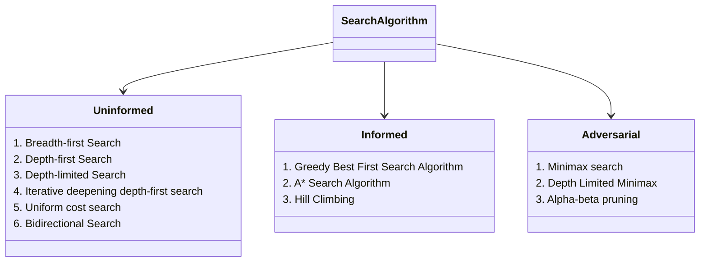

# ARITIFICIAL INTELLIGENCE

<!-- TODO: Notes on Turing Test-->

<!-- TODO: Add Sokobon Puzzle problem-->

## Search Algorithms

Search algorithms in AI are the algorithms that are created to aid the searchers in getting the right solution. The search issue contains search space, first start and end point. Now by performing simulation of scenarios and alternatives, searching algorithms help AI agents find the optimal state for the task. Artificial Intelligence is the study of building agents that act rationally. Most of the time, these agents perform some kind of search algorithm in the background in order to achieve their tasks.

Logic used in algorithms processes the initial state and tries to get the expected state as the solution. Because of this, AI machines and applications just functioning using search engines and solutions that come from these algorithms can only be as effective as the algorithms.

---

### Search Algorithm Terminologies

**Search**: Searchingis a step by step procedure to solve a search-problem in a given search space. A search problem can have three main factors:

- **Search Space**: Search space represents a set of possible solutions, which a system may have.
- **Start State**: It is a state from where agent begins the search.
- **Goal test**: It is a function which observe the current state and returns whether the goal state is achieved or not.

**Search tree**: A tree representation of search problem is called Search tree. The root of the search tree is the root node which is corresponding to the initial state.<br>
**Actions**: It gives the description of all the available actions to the agent.<br>
**Goal Test**: The condition that determines whether a given state is a goal state. For example, in a navigator app, the goal test would be whether the current location of the agent (the representation of the car) is at the destination. If it is — problem solved. If it’s not — we continue searching.<br>
**Transition model**: A description of what each action do, can be represented as a transition model.<br>
**Path Cost**: It is a function which assigns a numeric cost to each path.<br>
**Solution**: It is an action sequence which leads from the start node to the goal node.<br>

In a search process, data is often stored in a node, a data structure that contains the following data:

- A state
- Its parent node, through which the current node was generated
- The action that was applied to the state of the parent to get to the current node
- The path cost from the initial state to this node

Nodes contain information that makes them very useful for the purposes of search algorithms. They contain a state, which can be checked using the goal test to see if it is the final state. If it is, the node’s path cost can be compared to other nodes’ path costs, which allows choosing the optimal solution. Once the node is chosen, by virtue of storing the parent node and the action that led from the parent to the current node, it is possible to trace back every step of the way from the initial state to this node, and this sequence of actions is the solution.

However, nodes are simply a data structure — they don’t search, they hold information. To actually search, we use the frontier, the mechanism that “manages” the nodes. The frontier starts by containing an initial state and an empty set of explored items, and then repeats the following actions until a solution is reached

```

Repeat:

If the frontier is empty,
    - Stop. There is no solution to the problem.
Remove a node from the frontier. This is the node that will be considered.

If the node contains the goal state,
    Return the solution. Stop.
Else,
    - Expand the node (find all the new nodes that could be reached from this node), and add resulting nodes to the frontier.
    - Add the current node to the explored set.

```

**Properties of Search Algorithms:**

Following are the four essential properties of search algorithms to compare the efficiency of these algorithms:

**Completeness**: A search algorithm is said to be complete if it guarantees to return a solution if at least any solution exists for any random input.<br>
**Optimality**: If a solution found for an algorithm is guaranteed to be the best solution (lowest path cost) among all other solutions, then such a solution for is said to be an optimal solution.<br>
**Time Complexity**: Time complexity is a measure of time for an algorithm to complete its task.<br>
**Space Complexity**: It is the maximum storage space required at any point during the search, as the complexity of the problem.<br>

---

### Types of Search Algorithms



---

### Uninformed Search Algorithms

Uninformed search algorithms are fundamental tools in the field of Artificial Intelligence (AI) used to solve problems where the solution is not known in advance. These algorithms are also known as blind search algorithms because they operate without any specific knowledge about the problem domain.

The term means that the strategies have no additional information about states beyond that provided in the problem definition. All they can do is generate successors and distinguish a goal state from a non-goal state. All search strategies are distinguished by the order in which nodes are expanded.

---

#### Breadth-first Search

Breadth-first search is a <u>**complete search algorithm**</u>, guaranteeing that it will find a solution if one exists by exploring all nodes at each level of the search tree.

- It ensures optimality in terms of finding the shallowest goal node, but it may not always find the optimal solution in terms of the least-cost path if edge costs are not uniform.
  <br>
- The algorithm generates all shallower nodes before deeper ones, making it inefficient in terms of time and memory when the search tree is deep.
  <br>
- The use of a <u>**FIFO queue (Queue DS)**</u> for the frontier ensures that new nodes are always deeper than their parents, maintaining the breadth-first exploration strategy.
  <br>
- Breadth-first search applies the goal test when a node is generated, ensuring that any found goal node is indeed the shallowest one, eliminating the need to compare multiple shallow goal nodes.

**Algorithm** <br>

1. Start with an initial node containing the starting state of the problem and a path cost of 0.
2. Check if the initial state is a goal state. If it is, you're done, and you have a solution.
3. Create a queue (think of it as a line) called the "frontier" and add the initial node to it.
4. Create an empty set called "explored" to keep track of the states we've already seen.
5. Now, repeat the following steps:
   a. If the frontier is empty (there's no one left in the line), and you haven't found a solution, then you've failed to find a solution. So, return failure.<br>
   b. Take the node at the front of the line (the shallowest one).<br>
   c. Add the state of this node to the explored set, so we remember we've seen it.<br>
   d. For each possible action you can take from the current state: Create a new node that represents the result of taking that action.<br>
6. Keep repeating these steps until you either find a solution or determine that there is no solution (if the frontier becomes empty).<br>

**Completeness**: A search algorithm is complete if it guarantees finding a solution if one exists.<br>

**Optimality**: An optimal search algorithm finds the shortest path to the goal.<br>

**Time Complexity:**<br>

- In the worst case, BFS also has a time complexity of $O(𝑏^d)$(Exponential).
- However, BFS systematically explores all nodes at each depth level before moving to the next level.
- It is particularly efficient in finding the shortest path in an unweighted graph because it guarantees that the shallowest goal node is reached first.

**Space Complexity:**<br>

- The space complexity of BFS is typically $O(𝑏^d)$(Exponential) because it stores all nodes at each depth level in a queue.
- BFS can consume significant memory, especially when the branching factor is high or the tree is deep.
- It guarantees that it explores the shallowest nodes first, but this comes at the cost of increased memory usage.

Where, <br>b = branching factor (require finite b) <br>d = depth of shallowest solution.

All the nodes remain in memory, so both time and space complexity are $O(b^d)$. Exponential bounds like that are scary. As a typical real-world example, consider a problem with branch ing factor b = 10, processing speed 1 million nodes/second, and memory requirements of 1 Kbyte/node. A search to depth d = 10 would take less than 3 hours, but would require 10 terabytes of memory. The memory requirements are a bigger problem for breadth-first search than the execution time. But time is still an important factor. At depth d = 14, even with infinite memory, the search would take 3.5 years. In general, exponential-complexity search problems cannot be solved by uninformed search for any but the smallest instances.

---

---

#### Depth-First Search

Depth-First Search (DFS) is a complete search algorithm that explores as far as possible along a branch of the search tree before backtracking.

- It may <u>**not guarantee optimality**</u> in terms of finding the shortest path, especially when edge costs are not uniform.
- DFS tends to generate a deeper search tree before exploring shallower nodes, which can be more memory-efficient than BFS for deep search trees.
- It uses a <u>**LIFO (stack)**</u> for managing the frontier, which means it explores one branch entirely before moving on to the next.
- The goal test is applied when a node is selected for expansion, which may lead to multiple solutions.

**Algorithm**

1. Start with an initial node containing the starting state of the problem and a path cost of 0.
2. Check if the initial state is a goal state. If it is, you've found a solution.
3. Create a stack (think of it as a stack of plates) called the "frontier" and add the initial node to it.
4. Create an empty set called "explored" to keep track of the states we've already seen.
5. Now, repeat the following steps: <br>
   a. If the frontier is empty, return failure.<br>
   b. Take the node at the top of the stack (the deepest one).<br>
   c. Add the state of this node to the explored set<br>.
   d. For each possible action you can take from the current state: Create a new node that represents the result of taking that action.<br>
   e. Add the neighboring nodes to the stack.<br>
6. Keep repeating these steps until you either find a solution or determine that there is no solution (if the frontier becomes empty).<br>

**Completeness**: Yes (if the search tree is finite).

**Optimality**: No (it may not find the shortest path).

**Time Complexity**<br>

- In the worst case, DFS can have a time complexity of $O(𝑏^d )$ (Exponential)
- If the search tree is deep and has a high branching factor, DFS can take a long time to find a solution.
- DFS can perform relatively well when the solution is shallow or located early in the search space (small d).

**Space Complexity:**<br>

- The space complexity of DFS is typically $O(bd)$ (Linear), which accounts for the maximum depth of the search tree.
- It uses memory proportional to the depth of the tree because it needs to store all nodes along the current branch in the stack.
- DFS can be memory-efficient when the depth is limited, but it may run into memory issues with deep search trees.

**Advantages**

1. Memory Efficiency: DFS can be more memory-efficient than BFS for deep search trees because it explores deeply before moving to the next branch.
2. Simplicity: Like BFS, DFS is conceptually simple and easy to implement.
3. Solves Uninformed Problems: It's suitable for solving uninformed search problems where the goal is to find any valid solution.

**Disadvantages**

1. Completeness and Optimality: It may not find a solution in infinite or cyclical graphs and doesn't guarantee optimality.
2. Lack of Guidance: DFS doesn't use heuristic information, which can make it less efficient than informed search algorithms in some cases.
3. Potential Infinite Loops: In infinite graphs or graphs with cycles, DFS may get stuck in infinite loops without reaching a solution.
4. Not Suitable for Shortest Path: It doesn't prioritize finding the shortest path, making it unsuitable for certain problems.
5. DFS is not optimal in scenarios where:

- Optimal Path Is Required: For instance, finding the shortest path in a weighted graph. DFS does not guarantee that the first solution found is the shortest or most optimal.
- Large or Infinite Search Spaces: DFS can get stuck exploring large or infinite branches without ever finding a solution.

---

---

#### Depth-limited Search

1. DLS is a modification of DFS that restricts the depth of exploration.
2. It uses a depth limit parameter to determine how deep into the tree or graph it can explore
3. Depth-limited search alleviates the infinite-state space problem by setting a predetermined depth limit.
4. It solves the infinite-path problem but can be incomplete if the shallowest goal is beyond the limit.
5. Depth-limited search becomes nonoptimal if the depth limit is greater than the depth to the goal state.
6. Its time complexity is O($𝑏^d$), and its space complexity is O(bd), where b is the branching 𝑑 factor and d is the depth limit.
7. Depth-first search is a special case of depth-limited search with an infinite depth limit (∞).

|                                                                       | Depth-First Search (DFS)                                          | Depth-Limited Search (DLS)                                        |
| --------------------------------------------------------------------- | ----------------------------------------------------------------- | ----------------------------------------------------------------- |
| **Exploration Strategy**                                              | Explores as far as possible along a branch before backtracking    | Limits exploration to a specified depth and then backtracks       |
| **Completeness**                                                      | Not complete in infinite or cyclical graphs                       | Complete if depth limit >= depth of shallowest goal               |
| **Optimality**                                                        | Does not guarantee optimality                                     | Does not guarantee optimality, especially with low depth limit    |
| **Memory Usage**                                                      | Can be memory-efficient                                           | Can be memory-efficient, especially for shallow depth limits      |
| **Termination**                                                       | Can continue indefinitely in graphs with infinite paths           | Terminates when reaching the depth limit                          |
| **Used to control depth of exploration, efficiency, memory concerns** | Used to control depth of exploration, efficiency, memory concerns | Used to control depth of exploration, efficiency, memory concerns |

---

#### Iterative Deepening Depth-First Search

---

#### Uniform Cost Search

---

#### Bidirectional Search

---

| Algorithm                        | Complete? | Optimal Cost? | Time Complexity  | Space Complexity           |
| -------------------------------- | --------- | ------------- | ---------------- | -------------------------- |
| Breadth-First Search (BFS)       | Yes       | Yes           | $O(b^d)$         | $O(b^d)$                   |
| Depth-First Search (DFS)         | No        | No            | $O(b^d)$         | $O(bd)$                    |
| Depth-Limited Search (DLS)       | No        | No            | $O(b^l)$         | $O(bl)$ (l is depth limit) |
| Uniform Cost Search              | Yes       | Yes           | $O(b^{(C^*/ε)})$ | $O(b^{(C^*/ε)})$           |
| Iterative Deepening Search (IDS) | Yes       | Yes           | $O(b^d)$         | $O(bd)$                    |
| Bidirectional Search             | Yes       | Yes           | $O(b^{(d/2)})$   | $O(b^{(d/2)})$             |

where $C^*$ is the cost of optimal solution.

---

### Informed Search Algorithms

Uninformed search algorithms are used when there is no information available about the goal state. If there is some information that we can extract about the goal state then we take advantage of this information using a cost function which calculates both the distance from initial state to the current state and from current state to the goat state.

$$
f(n) =  h(n) + g(n)
$$

where: <br>
$h(n)$ is the huristic cost. <br>
$g(n)$ is the path cost from initial node. <br>
$f(n)$ is the evaluation function.

Huristic cost is calculated as, the distance from the current state to goal state. (Eg: Eucledian distance, Manhattan distance etc.)

In DFS or BFS we used either queue or stack to maintain the frotier and another list to maintain all the explored states. In Informed search algorithms, we use priority queues. Priority queues is a data structure, where the data is sorted after each insertion operation based on the value that the node it carries. Use this priority queues, we choose the best explorable state, with minimum cost value.

---

#### Huristic Function

The huristic fucntion is the main cost fucntion that gives us information about the goal node position, from our current position. It is denoted by $h(n)$, n being the current node, it calculates the cost from the current node to the goal node using some distance function. Most commonly used distances are Manhattan distance, Eucledian distance, Minkowski Distance etc.

**Manhattan distance**, also known as L1 distance or taxicab distance, is a way of measuring distance in a grid-like path. It calculates the total distance between two points by summing up the absolute differences of their coordinates.

$$
D = |x_1 - x_2| + |y_1 - y_2|
$$

In higher dimensions, for points $\mathbf{x}_i$ and $\mathbf{x}_j$ with coordinates $(x_{i1}, x_{i2}, \ldots, x_{id})$ and $(x_{j1}, x_{j2}, \ldots, x_{jd})$, the formula generalizes to:

$$
D(\mathbf{x}_i, \mathbf{x}_j) = \sum_{l=1}^{d} |x_{il} - x_{jl}|
$$

**Euclidean distance** is a measure of the straight-line distance between two points in Euclidean space. It is the most common and intuitive way of measuring distance, derived from the Pythagorean theorem.

The formula to calculate the Euclidean distance between two points $(x_1, y_1)$ and $(x_2, y_2)$ in a 2-dimensional space is:

$$
D = \sqrt{(x_2 - x_1)^2 + (y_2 - y_1)^2}
$$

In higher dimensions, for points $\mathbf{x}_i$ and $\mathbf{x}_j$ with coordinates $(x_{i1}, x_{i2}, \ldots, x_{id})$ and $(x_{j1}, x_{j2}, \ldots, x_{jd})$, the formula generalizes to:

$$
D(\mathbf{x}_i, \mathbf{x}_j) = \sqrt{\sum_{l=1}^{d} (x_{il} - x_{jl})^2}
$$

Euclidean distance is widely used in various fields such as mathematics, physics, computer science, and machine learning for tasks like clustering, classification, and optimization. It provides a direct and simple way to determine how far apart two points are in a multi-dimensional space.

There are some other popular distance metrics, but they are less generally applicable as heuristics.

**Chebyshev Distance** - the distance along a single coordinate, whichever is bigger. While this should usually be admissible (it will underestimate because it doesn't take into account movement along the other axes), it is strictly less informative than Manhattan distance. There may be some occasions where this is useful, but they are uncommon.

**Minkowski Distance** - a general case of Manhattan Distance and Euclidean (straight line) distance. However, it is notably less intuitive than either of those special cases, so, again, I can't come up with a good example of when you would choose it over one of them.A

$$
D(\mathbf{x}_i, \mathbf{x}_j) = \left( \sum_{l=1}^{d} \left| x_{il} - x_{jl} \right|^{1/p} \right)^p
$$

**Hamming Distance** - This isn't applicable to all problems, but it is calculated as the minimum number of edits that you would need to make to two vectors to make them identical. Since it is the minimum number, it would potentially be admissible for some problems, such as the word mutation game with equal length words. (If word lengths were unequal you would need to use Levenshtein Distance, which allows gaps to be inserted. This takes a fairly long time to compute (O(n^2)) and so is less likely to be an efficient heuristic).

**Canberra Distance**, a sort of scaled Manhattan Distance, is often used for points scattered around the origin, but would be inadmissible in many cases.

**Jaccard Distance** is a similarity measure used when comparing sets of features. It weights presences of features more strongly than absences. Problems in which you need to use a heuristic on feature sets are relatively uncommon, so it's hard to know what reasonable default assumptions for admissibility would be. In general, I would guess that the asymmetry between present and absent features could make Jaccard distance inadmissible for some problems, but that it's likely to not be a problem if you truly only care about present features.

##### Admisiable Huristic

If a Huristic never overestimates the cost, then we say the huristic is admissible.

What happens if the huristic is over-estimating? <br>
If the huristic is over-estimating the cost then the possiblility of getting an optimal path is not possible, but if the huristic is under-estimating the cost, then after reaching the goal state through non-optimal path, the evaluation cost would be higher than the cost from the smallest node in the frontier and the algorithm would explore the smallest node in the frontier and it will eventually find the optimal, i.e., the smallest path. So it is impossible to find an optimal path if the huristic function is over-estimating, so we need the huristic value to be always estiamte the cost same as the original cost or underestimate it.

> [REF](https://youtu.be/xz1Nq6cZejI?list=PLxCzCOWd7aiHGhOHV-nwb0HR5US5GFKFI)

##### Cosistent Huristic

A huristic $h(n)$ is consistent, if for every node `n` and every every successor `n'` of n generated by an action 'a', we have:

$$
h(b) \leq c(n, a, n') + h(n')
$$

---

#### Greedy Best First Search

In this algorithm we are given an initial state, we start with a priority queue frontier with this initial state and add all the explorable states to the frontier and arrange them in ascending order.

Only after a node is removed, we explore the node and add the next explorable nodes to the frontier. Whenever there is an insertion operation to the priority queue, we sort the queue to arrange all the nodes.

The cost function used in this algorithm is

$$
f(n) = h(n)
$$

The time and space complexity is given by $O(b^d)$ in worst case scenario.

---

#### Beam Search Algorithm

This is an updated version of Greedy Best First Search algorithm. We consider a beam width constrain in this algorithm, so the space complexity and time complexity are less when compared to GBFS algorithm.

Beam Width: It is denoted by $\beta$, and it states how many explorable nodes to be added to the frontier. Only the first $\beta$ number of nodes, with the small cost values are added to the frontier.

---

#### $A^*$ Search Algorithm

$A^*$ search algorithm uses the information given about the goal state using huristic function.
The Huristic function used by $A^*$ algorithm is given by

$$
f(n) =  h(n) + g(n)
$$

Priority queues are used for $A^*$ search algorithms.

---

#### Hill Climbing Search Algorithm

In Hill Climbing Search Algorithm, we use the greedy approach to change the states. We only select the next state based on the current state huristic value. If next state huristic value is less than the current state huristic value, then the algorithm choosed the next node with the minimum huristic value.

Hill-Climbing search is a local search algorithm that continuously moves towards the direction of increasing value (or decreasing cost) and is not guaranteed to find the global optimal solution as it may get stuck in local maxima or plateaus.

There are some problem to this algorithm.

1. If the next state doesn't have a huristic value that is less than the huristic value of the current node, then the algorithm will stop working.
2. If it reaches a local mimimum, where all the next states has higher huristic value and but after a constant raise it will reach the global minimum, but the algorithm will stop at the local minimum, since all of it's next states contains huristics higher than the current state, hence it doesn't return the optimal path, but might give some sub-optimal path.

---

Certainly! Here’s the updated table with the Hill-Climbing search algorithm included:

| Algorithm         | Optimal Path                    | Time Complexity | Space Complexity |
| ----------------- | ------------------------------- | --------------- | ---------------- |
| Greedy Best-First | No                              | $O(b^m)$        | $O(b^m)$         |
| A\*               | Yes (with admissible heuristic) | $O(b^d)$        | $O(b^d)$         |
| Uniform Cost      | Yes                             | $O(b^d)$        | $O(b^d)$         |
| Beam Search       | No                              | $O(b^m)$        | $O(k \times d)$  |
| Hill-Climbing     | No                              | $O(b^m)$        | $O(b \times m)$  |

Here:

- $b$ is the branching factor (average number of successors per state).
- $d$ is the depth of the optimal solution.
- $m$ is the maximum depth of the search space.
- $k$ is the beam width in Beam Search.

---

### Adversarial Search

Adversarial search algorithms are used in multi player games.

## Logic

In which we design agents that can form representations of a complex world, use a process of inference to derive new representations about the world, and use these new representations to deduce what to do.

1. Humans' intelligence relies on reasoning processes that operate on internal representations of knowledge, as exemplified by knowledge-based agents in AI.
2. Problem-solving agents, while knowledgeable in limited, domain-specific ways, can benefit from more flexible and domain-independent knowledge representations, such as logic.
3. Logic serves as a general class of representations for knowledge-based agents, enabling them to combine and adapt information for various purposes.
4. Propositional logic, though less expressive than first-order logic, offers fundamental concepts and powerful inference technologies for building knowledge-based agents.

---

### Propositional Logic

1. Humans' intelligence relies on reasoning processes that operate on internal representations of knowledge, as exemplified by knowledge-based agents in AI.
2. Problem-solving agents, while knowledgeable in limited, domain-specific ways, can
   benefit from more flexible and domain-independent knowledge representations, such as logic.
3. Logic serves as a general class of representations for knowledge-based agents, enabling them to combine and adapt information for various purposes.
4. Propositional logic, though less expressive than first-order logic, offers fundamental concepts and powerful inference technologies for building knowledge-based agents. Propositional logic is based on propositions, statements about the world that can be either true or false, as in sentences 1-5 above.

**Example**

1. If it didn’t rain, Harry visited Hagrid today.
2. Harry visited Hagrid or Dumbledore today, but not both.
3. Harry visited Dumbledore today.<br>
   Based on these three sentences, we can answer the question “did it rain today?”, even though none of the individual sentences tells us anything about whether it is raining today. Here is how we can go about it: looking at sentence 3, we know that Harry visited Dumbledore. Looking at sentence 2, we know that Harry visited either Dumbledore or Hagrid, and thus we can conclude

4. Harry did not visit Hagrid.<br>
   Now, looking at sentence 1, we understand that if it didn’t rain, Harry would have visited Hagrid. However, knowing sentence 4, we know that this is not the case. Therefore, we can conclude

5. It rained today.

To come to this conclusion, we used logic, and today’s lecture explores how AI can use logic to reach to new conclusions based on existing information.

**Sentence**<br>
A sentence is an assertion about the world in a knowledge representation language. A sentence is how AI stores knowledge and uses it to infer new information.

**Propositional Symbols** : Propositional symbols are most often letters (P, Q, R) that are used to represent a proposition.

---

#### Logical Connectives

Logical connectives are logical symbols that connect propositional symbols in order to reason in a more complex way about the world.

1. NOT $\neg$
2. AND $\land$
3. OR $\lor$
4. Exclusive OR (Only one is true, not both) $\oplus$
5. Implication $\rightarrow$
6. Bi-Implication $\iff$
7. NAND (Negation of AND) $\uparrow$
8. NOR (Negation of OR) $\downarrow$

**Priority order in Propositional Logic**

$$

( \quad ) \quad \textbf{>}\quad \neg\quad  \textbf{>}\quad \land\quad \textbf{>}\quad \lor\quad \textbf{>}\quad \rightarrow\quad \textbf{>}\quad \iff


$$

---

##### Not $(\lnot)$

inverses the truth value of the proposition. So, for example, if $P$: “It is raining,” then $\lnot P$: “It is not raining”.

Truth tables are used to compare all possible truth assignments to propositions. This tool will help us better understand the truth values of propositions when connected with different logical connectives. For example, below is our first truth table:

| $P$   | $\lnot P$ |
| ----- | --------- |
| false | true      |
| true  | false     |

---

##### And $(\land)$

connects two different propositions. When these two proposition, P and Q, are connected by $(\land)$, the resulting proposition $P \land) Q$ is true only in the case that both P and Q are true.

| P     | Q     | $P \land Q$ |
| ----- | ----- | ----------- |
| false | false | false       |
| false | true  | false       |
| true  | false | false       |
| true  | true  | true        |

---

##### Or $(\lor)$

is true as as long as either of its arguments is true. This means that for $P \lor Q$ to be true, at least one of P or Q has to be true.

| P     | Q     | $P \land Q$ |
| ----- | ----- | ----------- |
| false | false | false       |
| false | true  | true        |
| true  | false | true        |
| true  | true  | true        |

It is worthwhile to mention that there are two types of Or: an inclusive Or and an exclusive Or. In an exclusive Or, $P \lor Q$ is false if $P \land Q$ is true. That is, an exclusive Or requires only one of its arguments to be true and not both. An inclusive Or is true if any of $P$, $Q$, or $P \land Q$ is true. In the case of Or $(\lor)$, the intention is an inclusive Or.

---

##### Exclusive OR (XOR) $\oplus$

<!-- TODO: Add notes to this-->

---

##### Implication $(\to)$

represents a structure of “if $P$ then $Q$.” For example, if $P$: “It is raining” and $Q$: “I’m indoors”, then $P \to Q$ means “If it is raining, then I’m indoors.” In the case of $P$ implies $Q (P \to Q), P$ is called the **Hypothesis/Antecedent/Premise** and $Q$ is called the **Consequent/Conclusion**.<br>

When the antecedent is true, the whole implication is true in the case that the consequent is true (that makes sense: if it is raining and I’m indoors, then the sentence “if it is raining, then I’m indoors” is true). When the antecedent is true, the implication is false if the consequent is false (if I’m outside while it is raining, then the sentence “If it is raining, then I’m indoors” is false). However, when the antecedent is false, the implication is always true, regardless of the consequent. This can sometimes be a confusing concept. Logically, we can’t learn anything from an implication $(P \to Q)$ if the antecedent $(P)$ is false. Looking at our example, if it is not raining, the implication doesn’t say anything about whether I’m indoors or not. I could be an indoors type and never walk outside, even when it is not raining, or I could be an outdoors type and be outside all the time when it is not raining. When the antecedent is false, we say that the implication is trivially true.

| $P$   | $Q$   | $P \to Q$ |
| ----- | ----- | --------- |
| false | false | true      |
| false | true  | true      |
| true  | false | false     |
| true  | true  | true      |

---

##### **Biconditional ($\iff$)**

An implication that goes both directions. You can read it as “if and only if.” $P \iff Q$ is the same as $P → Q$ and $Q → P$ taken together. For example, if $P$: “It is raining.” and $Q$: “I’m indoors,” then $P \iff Q$ means that “If it is raining, then I’m indoors,” and “If I’m indoors, then it is raining.” This means that we can infer more than we could with a simple implication. If $P$ is false, then $Q$ is also false; if it is not raining, we know that I’m also not indoors.

| $P$   | $Q$   | $P \iff Q$ |
| ----- | ----- | ---------- |
| false | false | true       |
| false | true  | false      |
| true  | false | false      |
| true  | true  | true       |

---

#### Tautology, Contradition and Contingency

<!-- TODO: Add notes to this-->

**Tautology**: A given propositional/compound formula is always true. <br>
**Contrdiction**: The compund formula is always false. <br>
**Contingency**: Neither a Tautology not a Contradiction.

---

#### Satisfiable, Valid and Falsifiable

<!-- TODO: Add notes to this-->

**Satisfiable**: Atleast one time true. Either a tautology or contingency.
**Valid**: Always true. i.e., A Tautology
**Falsifiable**: Atleast one time false: Either a Contradiction or contingency.
**Un-falsifiable**: Always true. equivalent to Tautology, Valid
**Un-satisfiable**: Never true. Always false. equivalent to Contridiction.

---

#### Model

The model is an assignment of a truth value to every proposition. To reiterate, propositions are statements about the world that can be either true or false. However, knowledge about the world is represented in the truth values of these propositions. The model is the truth-value assignment that provides information about the world.

For example, if P: “It is raining.” and Q: “It is Tuesday.”, a model could be the following truth-value assignment: {P = True, Q = False}. This model means that it is raining, but it is not Tuesday. However, there are more possible models in this situation (for example, {P = True, Q = True}, where it is both raining and a Tuesday). In fact, the number of possible models is 2 to the power of the number of propositions. In this case, we had 2 propositions, so 2^2 = 4 possible models.

---

#### Knowledge Base (KB)

The knowledge base is a set of sentences known by a knowledge-based agent. This is knowledge that the AI is provided about the world in the form of propositional logic sentences that can be used to make additional inferences about the world.

---

#### Entailment (⊨)

If $α ⊨ β$ ($α$ entails $β$), then in any world where $α$ is true, $β$ is true, too.

For example, if α: “It is a Tuesday in January” and β: “It is January,” then we know that $α ⊨ β$. If it is true that it is a Tuesday in January, we also know that it is January. Entailment is different from implication. Implication is a logical connective between two propositions. Entailment, on the other hand, is a relation that means that if all the information in α is true, then all the information in $β$ is true.

---

### Inference

Inference is the process of deriving new sentences from old ones.

For instance, in the Harry Potter example earlier, sentences 4 and 5 were inferred from sentences 1, 2, and 3.

There are multiple ways to infer new knowledge based on existing knowledge. First, we will consider the Model Checking algorithm.

To determine if $KB ⊨ α$ (in other words, answering the question: “can we conclude that α is true based on our knowledge base”)
Enumerate all possible models.
If in every model where KB is true, α is true as well, then KB entails $α (KB ⊨ α)$.

**Consider the following example:**

$P$: It is a Tuesday. <br>
$Q$: It is raining. <br>
$R$: Harry will go for a run. $KB: (P ∧ ¬Q) → R$ (in words, $P$ and not $Q$ imply $R$) $P$ ($P$ is true) $¬Q$ ($Q$ is false) <br>
Query: $R$ (We want to know whether R is true or false; Does $KB ⊨ R$?$)

To answer the query using the Model Checking algorithm, we enumerate all possible models.

To answer the query using the Model Checking algorithm, we enumerate all possible models.

| P     | Q     | R     | KB  |
| ----- | ----- | ----- | --- |
| false | false | false |     |
| false | false | true  |     |
| false | true  | false |     |
| false | true  | true  |     |
| true  | false | false |     |
| true  | false | true  |     |
| true  | true  | false |     |
| true  | true  | true  |     |

Then, we go through every model and check whether it is true given our Knowledge Base.

First, in our KB, we know that P is true. Thus, we can say that the KB is false in all models where P is not true.

| P     | Q     | R     | KB    |
| ----- | ----- | ----- | ----- |
| false | false | false | false |
| false | false | true  | false |
| false | true  | false | false |
| false | true  | true  | false |
| true  | false | false |       |
| true  | false | true  |       |
| true  | true  | false |       |
| true  | true  | true  |       |

Next, similarly, in our KB, we know that Q is false. Thus, we can say that the KB is false in all models where Q is true.

| P     | Q     | R     | KB    |
| ----- | ----- | ----- | ----- |
| false | false | false | false |
| false | false | true  | false |
| false | true  | false | false |
| false | true  | true  | false |
| true  | false | false |       |
| true  | false | true  |       |
| true  | true  | false | false |
| true  | true  | true  | false |

Finally, we are left with two models. In both, $P$ is true and $Q$ is false. In one model $R$ is true and in the other $R$ is false. Due to $(P ∧ ¬Q) → R$ being in our $KB$, we know that in the case where $P$ is true and $Q$ is false, $R$ must be true. Thus, we say that our KB is false for the model where $R$ is false, and true for the model where $R$ is true.

| P     | Q     | R     | KB    |
| ----- | ----- | ----- | ----- |
| false | false | false | false |
| false | false | true  | false |
| false | true  | false | false |
| false | true  | true  | false |
| true  | false | false | false |
| true  | false | true  | true  |
| true  | true  | false | false |
| true  | true  | true  | false |

Looking at this table, there is only one model where our knowledge base is true. In this model, we see that $R$ is also true. By our definition of entailment, if $R$ is true in all models where the $KB$ is true, then $KB ⊨ R$.

To run the Model Checking algorithm, the following information is needed:

- Knowledge Base, which will be used to draw inferences
- A query, or the proposition that we are interested in whether it is entailed by the KB
- Symbols, a list of all the symbols (or atomic propositions) used (in our case, these are rain, hagrid, and dumbledore)
- Model, an assignment of truth and false values to symbols

Note that we are interested only in the models where the $KB$ is true. If the $KB$ is false, then the conditions that we know to be true are not occurring in these models, making them irrelevant to our case.

> Let <br> $P$: Harry plays seeker, <br>$Q$: Oliver plays keeper, <br>$R$: Gryffindor wins. <br>Our $KB$ specifies that $P Q (P ∧ Q) \to R$. In other words, we know that $P$ is true, i.e. Harry plays seeker, and that $Q$ is true, i.e. Oliver plays keeper, and that if both $P$ and $Q$ are true, then $R$ is true, too, meaning that Gryffindor wins the match. Now imagine a model where Harry played beater instead of seeker (thus, Harry did not play seeker, $\lnot P$). Well, in this case, we don’t care whether Gryffindor won (whether $R$ is true or not), because we have the information in our KB that Harry played seeker and not beater. We are only interested in the models where, as in our case, $P$ and $Q$ are true.)

Further, the way the check_all function works is recursive. That is, it picks one symbol, creates two models, in one of which the symbol is true and in the other the symbol is false, and then calls itself again, now with two models that differ by the truth assignment of this symbol. The function will keep doing so until all symbols will have been assigned truth-values in the models, leaving the list symbols empty. Once it is empty (as identified by the line if not symbols), in each instance of the function (wherein each instance holds a different model), the function checks whether the $KB$ is true given the model. If the $KB$ is true in this model, the function checks whether the query is true, as described earlier.

---

### Knowledge Engineering

Knowledge engineering is the process of figuring out how to represent propositions and logic in AI.

Let’s practice knowledge engineering using the game Clue.

In the game, a murder was committed by a person, using a tool in a location. People, tools, and locations are represented by cards. One card of each category is picked at random and put in an envelope, and it is up to the participants to uncover whodunnit. Participants do so by uncovering cards and deducing from these clues what must be in the envelope. We will use the Model Checking algorithm from before to uncover the mystery. In our model, we mark as `True` items that we know are related to the murder and `False` otherwise.

For our purposes, suppose we have three people: Mustard, Plum, and Scarlet, three tools: knife, revolver, and wrench, and three locations: ballroom, kitchen, and library.

We can start creating our knowledge base by adding the rules of the game. We know for certain that one person is the murderer, that one tool was used, and that the murder happened in one location. This can be represented in propositional logic the following way:

$(Mustard ∨ Plum ∨ Scarlet)$

$(knife ∨ revolver ∨ wrench)$

$(ballroom ∨ kitchen ∨ library)$

The game starts with each player seeing one person, one tool, and one location, thus knowing that they are not related to the murder. Players do not share the information that they saw in these cards. Suppose our player gets the cards of Mustard, kitchen, and revolver. Thus, we know that these are not related to the murder and we can add to our KB

$¬(Mustard)$

$¬(kitchen)$

$¬(revolver)$

In other situations in the game, one can make a guess, suggesting one combination of person, tool and location. Suppose that the guess is that Scarlet used a wrench to commit the crime in the library. If this guess is wrong, then the following can be deduced and added to the KB:

$(¬Scarlet ∨ ¬library ∨ ¬wrench)$

Now, suppose someone shows us the Plum card. Thus, we can add

$¬(Plum)$

to our KB.

At this point, we can conclude that the murderer is Scarlet, since it has to be one of Mustard, Plum, and Scarlet, and we have evidence that the first two are not it.

Adding just one more piece of knowledge, for example, that it is not the ballroom, can give us more information. First, we update our KB

$¬(ballroom)$

And now, using multiple previous pieces of data, we can deduce that Scarlet committed the murder with a knife in the library. We can deduce that it’s the library because it has to be either the ballroom, the kitchen, or the library, and the first two were proven to not be the locations. However, when someone guessed Scarlet, library, wrench, the guess was false. Thus, at least one of the elements in this statement has to be false. Since we know both Scarlet and library to be true, we know that the wrench is the false part here. Since one of the three instruments has to be true, and it’s not the wrench nor the revolver, we can conclude that it is the knife.

We can look at other logic puzzles as well. Consider the following example: four different people, Gilderoy, Pomona, Minerva, and Horace, are assigned to four different houses, Gryffindor, Hufflepuff, Ravenclaw, and Slytherin. There is exactly one person in each house. Representing the puzzle’s conditions in propositional logic is quite cumbersome. First, each of the possible assignments will have to be a proposition in itself:
<br>MinervaGryffindor, MinervaHufflepuff, MinervaRavenclaw, MinervaSlytherin, PomonaGryffindor… <br>Second, to represent that each person belongs to a house, an Or statement is required with all the possible house assignments per person

$(MinervaGryffindor ∨ MinervaHufflepuff ∨ MinervaRavenclaw ∨ MinervaSlytherin)$, repeat for every person.

Then, to encode that if one person is assigned to one house, they are not assigned to the other houses, we will write

$$
(MinervaGryffindor → ¬MinervaHufflepuff) ∧ (MinervaGryffindor → ¬MinervaRavenclaw) ∧ (MinervaGryffindor → ¬MinervaSlytherin) ∧ (MinervaHufflepuff → ¬MinervaGryffindor)…
$$

and so on for all houses and all people. A solution to this inefficiency is offered in the section on first order logic. However, this type of riddle can still be solved with either type of logic, given enough cues.

---

### Inference Rules

Model Checking is not an efficient algorithm because it has to consider every possible model before giving the answer (a reminder: a query R is true if under all the models (truth assignments) where the KB is true, R is true as well). Inference rules allow us to generate new information based on existing knowledge without considering every possible model.

Inference rules are usually represented using a horizontal bar that separates the top part, the premise, from the bottom part, the conclusion. The premise is whatever knowledge we have, and the conclusion is what knowledge can be generated based on the premise.

<span align = 'center'>

```
If it is raining, then harry is inside
It is raining
--------------------------------------
Harry is inside
```

</span>

In this example, our premise consists of the following propositions:

- If it is raining, then Harry is inside.<br>
- It is raining.<br>

Based on this, most reasonable humans can conclude that

- Harry is inside.<br>

**Modus Ponens**

The type of inference rule we use in this example is Modus Ponens, which is a fancy way of saying that if we know an implication and its antecedent to be true, then the consequent is true as well.

<span align = 'center'>

```
α --> β
α
--------
β
```

</span>

**And Elimination**

If an And proposition is true, then any one atomic proposition within it is true as well. For example, if we know that Harry is friends with Ron and Hermione, we can conclude that Harry is friends with Hermione.

<span align = 'center'>

```
α ʌ β
--------
β
```

</span>

**Double Negation Elimination**

A proposition that is negated twice is true. For example, consider the proposition “It is not true that Harry did not pass the test”. We can parse it the following way: “It is not true that (Harry did not pass the test)”, or “¬(Harry did not pass the test)”, and, finally “¬(¬(Harry passed the test)).” The two negations cancel each other, marking the proposition “Harry passed the test” as true.

<span align = 'center'>

```
¬(¬α)
--------
α
```

</span>

**Implication Elimination**

An implication is equivalent to an Or relation between the negated antecedent and the consequent. As an example, the proposition “If it is raining, Harry is inside” is equivalent to the proposition “(it is not raining) or (Harry is inside).”

<span align = 'center'>

```
α --> β
--------
¬α v β
```

</span>

This one can be a little confusing. However, consider the following truth table:

| P     | Q     | P → Q | ¬P ∨ Q |
| ----- | ----- | ----- | ------ |
| false | false | true  | true   |
| false | true  | true  | true   |
| true  | false | false | false  |
| true  | true  | true  | true   |

Since P → Q and ¬P ∨ Q have the same truth-value assignment, we know them to be equivalent logically. Another way to think about this is that an implication is true if either of two possible conditions is met: first, if the antecedent is false, the implication is trivially true (as discussed earlier, in the section on implication). This is represented by the negated antecedent P in ¬P ∨ Q, meaning that the proposition is always true if P is false. Second, the implication is true when the antecedent is true only when the consequent is true as well. That is, if P and Q are both true, then ¬P ∨ Q is true. However, if P is true and Q is not, then ¬P ∨ Q is false.

**Biconditional Elimination**

A biconditional proposition is equivalent to an implication and its inverse with an And connective. For example, “It is raining if and only if Harry is inside” is equivalent to (“If it is raining, Harry is inside” And “If Harry is inside, it is raining”).

<span align = 'center'>

```
α <-> β
----------------------
(α --> β) ʌ (β --> α)
```

</span>

**De Morgan’s Law**

It is possible to turn an And connective into an Or connective. Consider the following proposition: “It is not true that both Harry and Ron passed the test.” From this, it is possible to conclude that “It is not true that Harry passed the test” Or “It is not true that Ron passed the test.” That is, for the And proposition earlier to be true, at least one of the propositions in the Or propositions must be true.

<span align = 'center'>

```
¬(α ʌ β)
----------------------
¬α V ¬β
```

</span>
Similarly, it is possible to conclude the reverse. Consider the proposition “It is not true that Harry or Ron passed the test.” This can be rephrased as “Harry did not pass the test” And “Ron did not pass the test.”

<span align = 'center'>

```
¬(α V β)
----------------------
¬α ʌ ¬β
```

</span>

**Distributive Property**

A proposition with two elements that are grouped with And or Or connectives can be distributed, or broken down into, smaller units consisting of And and Or.

<span align = 'center'>

```
(α ʌ(β V γ))
----------------------
(α ʌ β) V (α ʌ γ)
```

</span>

<span align = 'center'>

```
(α V (β ʌ γ))
----------------------
(α V β) ʌ (α V γ)
```

</span>

**Knowledge and Search Problems**

Inference can be viewed as a search problem with the following properties:

- Initial state: starting knowledge base
- Actions: inference rules
- Transition model: new knowledge base after inference
- Goal test: checking whether the statement that we are trying to prove is in the KB
- Path cost function: the number of steps in the proof

This shows just how versatile search algorithms are, allowing us to derive new information based on existing knowledge using inference rules.

---

### Resolution

Resolution is a powerful inference rule that states that if one of two atomic propositions in an Or proposition is false, the other has to be true. For example, given the proposition “Ron is in the Great Hall” Or “Hermione is in the library”, in addition to the proposition “Ron is not in the Great Hall,” we can conclude that “Hermione is in the library.” More formally, we can define resolution the following way:

<span align = 'center'>

```
P V Q
¬P
----------------------
Q
```

</span>

Resolution relies on Complementary Literals, two of the same atomic propositions where one is negated and the other is not, such as P and ¬P.

Resolution can be further generalized. Suppose that in addition to the proposition “Ron is in the Great Hall” Or “Hermione is in the library”, we also know that “Ron is not in the Great Hall” Or “Harry is sleeping.” We can infer from this, using resolution, that “Hermione is in the library” Or “Harry is sleeping.” To put it in formal terms:

<span align = 'center'>

```
P V Q
¬P V Q
----------------------
Q V R
```

</span>

Complementary literals allow us to generate new sentences through inferences by resolution. Thus, inference algorithms locate complementary literals to generate new knowledge.

A Clause is a disjunction of literals (a propositional symbol or a negation of a propositional symbol, such as $P$, $¬P$). A disjunction consists of propositions that are connected with an Or logical connective $(P ∨ Q ∨ R)$. A conjunction, on the other hand, consists of propositions that are connected with an And logical connective $(P ∧ Q ∧ R)$. Clauses allow us to convert any logical statement into a **Conjunctive Normal Form (CNF)**, which is a conjunction of clauses, for example: $(A ∨ B ∨ C) ∧ (D ∨ ¬E) ∧ (F ∨ G)$.

Steps in Conversion of Propositions to Conjunctive Normal Form

- Eliminate biconditionals
  - Turn $(α <-> β)$ into $(α → β) ∧ (β → α)$.
- Eliminate implications
  - Turn $(α → β)$ into $¬α ∨ β$.
- Move negation inwards until only literals are being negated (and not clauses), using De Morgan’s Laws.
  - Turn $¬(α ∧ β)$ into $¬α ∨ ¬β$

Here’s an example of converting $(P ∨ Q) → R$ to Conjunctive Normal Form:

- $(P ∨ Q) → R$
- $¬(P ∨ Q) ∨ R \quad \text{Eliminate implication}$
- $(¬P ∧ ¬Q) ∨ R \quad \text{De Morgan’s Law}$
- $(¬P ∨ R) ∧ (¬Q ∨ R) \quad \text{Distributive Law}$

At this point, we can run an inference algorithm on the conjunctive normal form. Occasionally, through the process of inference by resolution, we might end up in cases where a clause contains the same literal twice. In these cases, a process called factoring is used, where the duplicate literal is removed. For example, $(P ∨ Q ∨ S) ∧ (¬P ∨ R ∨ S)$ allow us to infer by resolution that $(Q ∨ S ∨ R ∨ S)$. The duplicate $S$ can be removed to give us $(Q ∨ R ∨ S)$.

Resolving a literal and its negation, i.e. $¬P$ and $P$, gives the empty clause (). The empty clause is always false, and this makes sense because it is impossible that both $P$ and $¬P$ are true. This fact is used by the resolution algorithm.

- To determine if $KB ⊨ α$:
  - Check: is $(KB ∧ ¬α)$ a contradiction?
    - If so, then $KB ⊨ α$.
    - Otherwise, no entailment.<br>

Proof by contradiction is a tool used often in computer science. If our knowledge base is true, and it contradicts $¬α$, it means that $¬α$ is false, and, therefore, α must be true. More technically, the algorithm would perform the following actions:

- To determine if $KB ⊨ α$:
  - Convert $(KB ∧ ¬α)$ to Conjunctive Normal Form.
  - Keep checking to see if we can use resolution to produce a new clause.
  - If we ever produce the empty clause (equivalent to False), congratulations! We have arrived at a contradiction, thus proving that $KB ⊨ α$.
  - However, if contradiction is not achieved and no more clauses can be inferred, there is no entailment.<br>

Here is an example that illustrates how this algorithm might work:

- Does $(A ∨ B) ∧ (¬B ∨ C) ∧ (¬C)$ entail $A$?<br>
- First, to prove by contradiction, we assume that A is false. Thus, we arrive at $(A ∨ B) ∧ (¬B ∨ C) ∧ (¬C) ∧ (¬A)$.<br>
- Now, we can start generating new information. Since we know that $C$ is false $(¬C)$, the only way $(¬B ∨ C)$ can be true is if $B$ is false, too. Thus, we can add $(¬B)$ to our $KB$.<br>
- Next, since we know $(¬B)$, the only way $(A ∨ B)$ can be true is if $A$ is true. Thus, we can add $(A)$ to our $KB$.<br>
- Now our KB has two complementary literals, $(A)$ and $(¬A)$. We resolve them, arriving at the empty set, (). The empty set is false by definition, so we have arrived at a contradiction.<br>

---

### Predicate Logical / First Order Logic

First order logic is another type of logic that allows us to express more complex ideas more succinctly than propositional logic. First order logic uses two types of symbols: Constant Symbols and Predicate Symbols. Constant symbols represent objects, while predicate symbols are like relations or functions that take an argument and return a true or false value.

For example, we return to the logic puzzle with different people and house assignments at Hogwarts. The constant symbols are people or houses, like Minerva, Pomona, Gryffindor, Hufflepuff, etc. The predicate symbols are properties that hold true or false of some constant symbols. For example, we can express the idea that Minerva is a person using the sentence Person(Minerva). Similarly, we can express the idea the Gryffindor is a house using the sentence House(Gryffindor). All the logical connectives work in first order logic the same way as before. For example, ¬House(Minerva) expresses the idea that Minerva is not a house. A predicate symbol can also take two or more arguments and express a relation between them. For example, BelongsTo expresses a relation between two arguments, the person and the house to which the person belongs. Thus, the idea that Minerva belongs to Gryffindor can be expressed as BelongsTo(Minerva, Gryffindor). First order logic allows having one symbol for each person and one symbol for each house. This is more succinct than propositional logic, where each person—house assignment would require a different symbol.

---

#### Universal Quantification

Quantification is a tool that can be used in first order logic to represent sentences without using a specific constant symbol. Universal quantification uses the symbol ∀ to express “for all.” So, for example, the sentence ∀x. BelongsTo(x, Gryffindor) → ¬BelongsTo(x, Hufflepuff) expresses the idea that it is true for every symbol that if this symbol belongs to Gryffindor, it does not belong to Hufflepuff.

---

#### Existential Quantification

Existential quantification is an idea parallel to universal quantification. However, while universal quantification was used to create sentences that are true for all x, existential quantification is used to create sentences that are true for at least one x. It is expressed using the symbol ∃. For example, the sentence ∃x. House(x) ∧ BelongsTo(Minerva, x) means that there is at least one symbol that is both a house and that Minerva belongs to it. In other words, this expresses the idea that Minerva belongs to a house.

Existential and universal quantification can be used in the same sentence. For example, the sentence ∀x. Person(x) → (∃y. House(y) ∧ BelongsTo(x, y)) expresses the idea that if x is a person, then there is at least one house, y, to which this person belongs. In other words, this sentence means that every person belongs to a house.

There are other types of logic as well, and the commonality between them is that they all exist in pursuit of representing information. These are the systems we use to represent knowledge in our AI.

## InDepth

 <!-- REQ:-->

1. Admisiable huristics in informed search
2. Optimal paths in BFS and DFS
3. Time and Space compleity for search algorithms
4. Bayesian Networks

## Reference

1. [CS40's Intro to Ai](https://cs50.harvard.edu/ai/2024/notes/0/)
2. [GFG - AI](https://www.geeksforgeeks.org/artificial-intelligence/)
